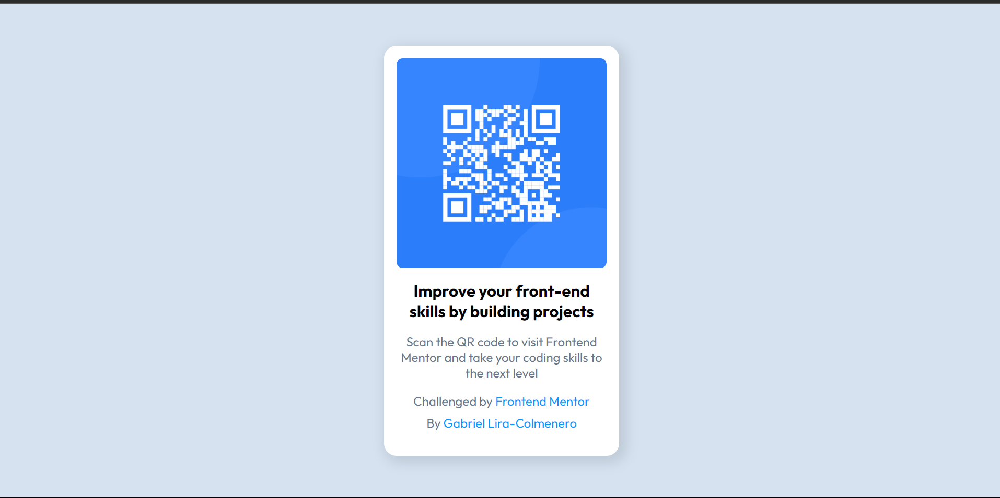

# Frontend Mentor - QR code component solution

This is a solution to the [QR code component challenge on Frontend Mentor](https://www.frontendmentor.io/challenges/qr-code-component-iux_sIO_H). Frontend Mentor challenges help you improve your coding skills by building realistic projects.

## Table of contents

- [Frontend Mentor - QR code component solution](#frontend-mentor---qr-code-component-solution)
  - [Table of contents](#table-of-contents)
  - [Overview](#overview)
    - [Screenshot](#screenshot)
    - [Links](#links)
  - [My process](#my-process)
    - [Built with](#built-with)
    - [What I learned](#what-i-learned)
    - [Continued development](#continued-development)
    - [Useful resources](#useful-resources)
  - [Author](#author)

## Overview

### Screenshot




### Links

- Solution URL: [Add solution URL here](https://github.com/Gabito0/QR-code-component)
- Live Site URL: [Add live site URL here](https://qr-code-component-tau-beige.vercel.app/)

## My process

### Built with

- Semantic HTML5 markup
- Flexbox
- Mobile-first workflow

### What I learned

I got more comfortable with using flex-box.

```css
body {
  background-color: hsl(212, 45%, 89%);
  display: flex;
  flex-flow: column;
  align-items: center;
  justify-content: center;
  height: 100vh;
  font-family: Outfit, sans-serif;
  font-size: 1rem;
}
```

### Continued development

I want to improve in media queries, and I will get more practice in the upcoming challenges.

### Useful resources

- [Example resource 1](https://youtu.be/OXGznpKZ_sA?si=-t_VBoSSu1X_OCHb) - This video helped me understand how to use flex-box.

## Author

- Website - [Gabriel Lira-Colmenero](https://portfolio-bccw.onrender.com/)
- Frontend Mentor - [@Gabito0](https://www.frontendmentor.io/profile/Gabito0)
